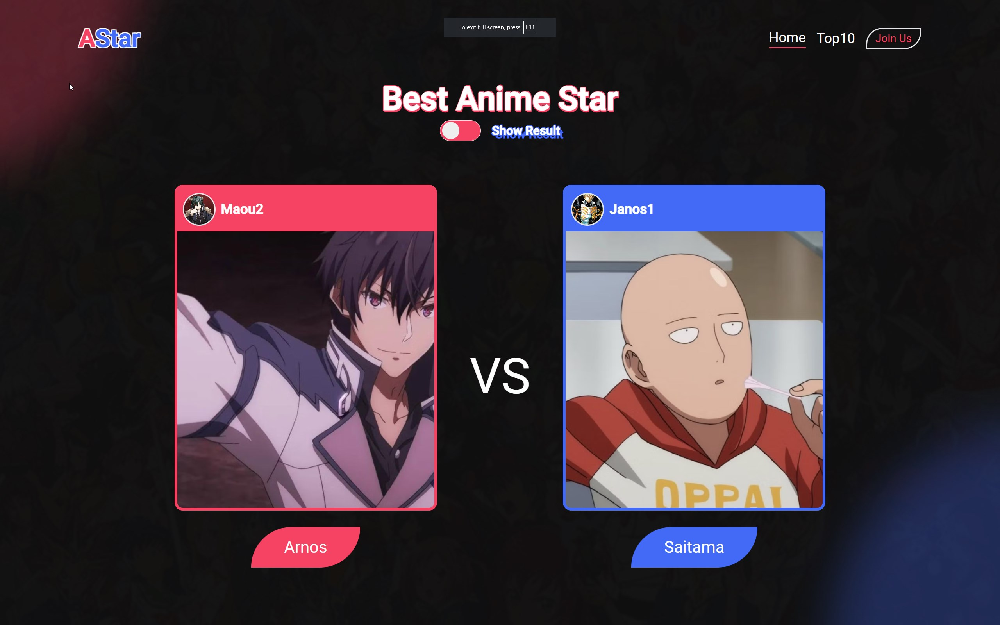
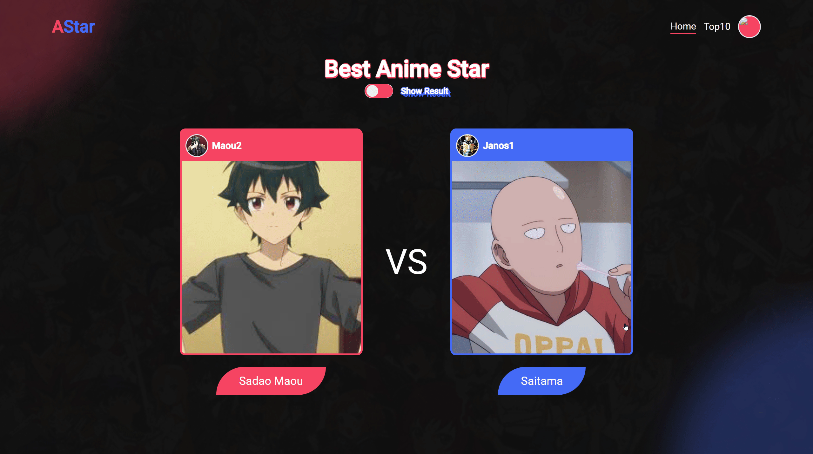

# Anime Mash

Anime Mash is a fun, interactive web application inspired by Facemash, but focused on anime characters. Users can vote for their favorite anime characters in head-to-head comparisons, helping to determine the most popular characters in the anime world.

## Project Repositories

This project consists of two main components:

1. [Frontend (AllStar-WebSite)](https://github.com/MaouStan/AllStar-WebSite)
2. [Backend API (AllStar-API)](https://github.com/MaouStan/AllStar-API)

## Features

- Head-to-head comparisons of anime characters
- Voting system to choose the best character
- Leaderboard of top-rated characters
- Responsive design for both desktop and mobile devices
- User authentication and management
- Image upload and retrieval
- Ranking system based on user votes

## Technology Stack

### Frontend (Angular)
- Angular
- TypeScript
- Angular Material (for UI components)
- Firebase (for frontend hosting)

### Backend (Node.js)
- Node.js
- Express.js
- MySQL
- Firebase Storage
- TypeScript

## License

This project is licensed under the MIT License.

Copyright (c) 2023 MaouStan

Permission is hereby granted, free of charge, to any person obtaining a copy
of this software and associated documentation files (the "Software"), to deal
in the Software without restriction, including without limitation the rights
to use, copy, modify, merge, publish, distribute, sublicense, and/or sell
copies of the Software, and to permit persons to whom the Software is
furnished to do so, subject to the following conditions:

The above copyright notice and this permission notice shall be included in all
copies or substantial portions of the Software.

THE SOFTWARE IS PROVIDED "AS IS", WITHOUT WARRANTY OF ANY KIND, EXPRESS OR
IMPLIED, INCLUDING BUT NOT LIMITED TO THE WARRANTIES OF MERCHANTABILITY,
FITNESS FOR A PARTICULAR PURPOSE AND NONINFRINGEMENT. IN NO EVENT SHALL THE
AUTHORS OR COPYRIGHT HOLDERS BE LIABLE FOR ANY CLAIM, DAMAGES OR OTHER
LIABILITY, WHETHER IN AN ACTION OF CONTRACT, TORT OR OTHERWISE, ARISING FROM,
OUT OF OR IN CONNECTION WITH THE SOFTWARE OR THE USE OR OTHER DEALINGS IN THE
SOFTWARE.

## Acknowledgments

- Inspired by Facemash
- Thanks to all the anime creators and fans who make this possible
